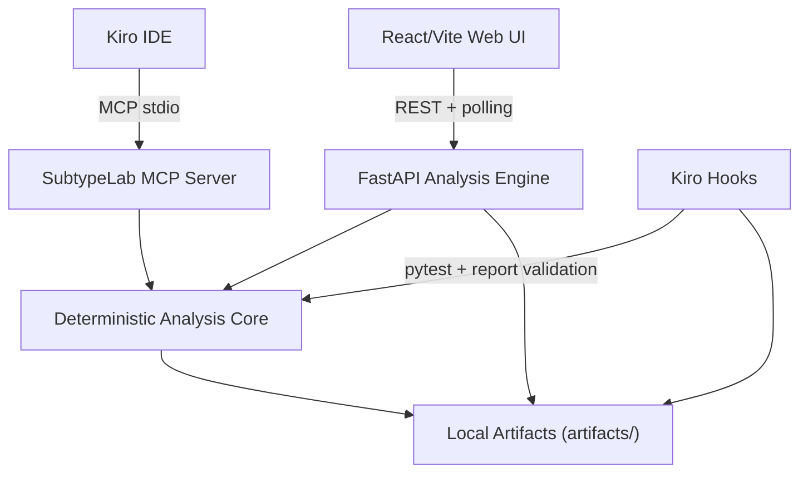

# Design Document

## Product Shape

SubtypeLab is a local-first reproducibility workbench for cancer subtype and biomarker claims. The application takes a gene-expression-style matrix, an optional sample metadata file, and a claim such as "these samples form three stable subtypes." It then runs deterministic perturbation tests and returns a computed verdict: `robust`, `suspicious`, or `fragile`.

This is intentionally not an AI wrapper. Kiro is used as the development and orchestration layer through specs, steering docs, hooks, and MCP tools. The scientific outputs come from deterministic code in the analysis engine.

The hackathon story is:

1. A researcher loads a synthetic or uploaded dataset.
2. SubtypeLab shows quality warnings before analysis.
3. The researcher enters a subtype or biomarker claim.
4. The engine runs baseline clustering and visualizes the result.
5. The engine stress-tests the claim across perturbations.
6. The UI shows which evidence survived and which biomarkers look unstable.
7. The app exports JSON and HTML reproducibility reports.

## Architecture

## Runtime Surfaces

- **Analysis Engine**: `packages/analysis-engine/analysis_engine`
- **Web UI**: `apps/web`
- **Kiro MCP Server**: `packages/kiro-mcp-server/mcp_server`
- **Kiro Specs/Hooks/Steering**: `.kiro/`
- **Generated Reports**: `artifacts/`
- **Synthetic Demo Data**: `demo-data/`

The default judge path is `docker compose up --build`. No cloud services, API keys, real patient data, or third-party biological datasets are required.

## Analysis Engine

The engine owns all computational claims. It uses deterministic NumPy/Pandas implementations so the app remains easy to run locally:

- synthetic demo data generation from fixed seed `42`
- CSV/TSV expression matrix parsing
- optional CSV/TSV metadata parsing and sample alignment
- dataset hashing with SHA-256
- quality metrics and per-feature summaries
- normalization variants: `none`, `log2`, `z-score`, `zscore`, `quantile`
- deterministic k-means clustering
- silhouette score
- PCA projection via SVD
- adjusted Rand index
- perturbation suite
- biomarker robustness ranking
- verdict thresholds
- JSON and HTML reproducibility report generation
- prohibited clinical-language validation from config

The current implementation avoids `scikit-learn` and charting dependencies for the MVP. That is a deliberate deployment choice, not a conceptual limitation.

## Dataset Model

Expression matrices use rows as samples and columns as features. The parser accepts `.csv`, `.tsv`, and `.tab` files. If the first column is named `sample_id`, `sample`, `id`, or `index`, it becomes the sample index. Otherwise sample IDs are generated as `S001`, `S002`, etc.

Optional metadata is aligned by sample ID when possible. If metadata has the same number of rows but no matching sample ID index, it is aligned by row order. Misaligned metadata fails with a descriptive error.

The built-in demo dataset is fully synthetic:

- 90 samples
- 300 features
- three embedded subtype signals
- weaker fragile biomarker-looking signal
- three synthetic batch labels
- deterministic seed `42`

## Claim Audit Flow

1. Validate claim language against the prohibited terms config.
2. Parse claim type and subtype count.
3. Normalize the matrix.
4. Run baseline k-means clustering.
5. Compute baseline silhouette, WCSS, PCA, heatmap payload, and top features.
6. Run 17 perturbation runs:
   - three feature-dropout levels
   - three noise levels
   - six cohort-split halves
   - four normalization variants
   - one batch-like mean shift
7. Compare each perturbation against the baseline using adjusted Rand index.
8. Aggregate per-perturbation-type scores and overall stability.
9. Compute verdict:
   - `>= 0.75`: `robust`
   - `>= 0.50` and `< 0.75`: `suspicious`
   - `< 0.50`: `fragile`
10. Rank biomarkers by repeated top-K appearance across perturbations.
11. Flag top features that behave like one-run artifacts.
12. Generate JSON and HTML reproducibility reports.

## API Surface

Primary endpoints:

- `GET /healthz`
- `GET /api/datasets/demo`
- `POST /api/datasets/upload`
- `GET /api/datasets/{dataset_id}/quality`
- `POST /api/claims/parse`
- `POST /api/baseline`
- `POST /api/jobs/audit`
- `GET /api/jobs/{job_id}/status`
- `GET /api/jobs/{job_id}/artifacts`
- `GET /api/jobs/{job_id}/result`
- `POST /api/reports/generate`
- `GET /api/reports/{report_id}`
- `GET /api/reports/{report_id}/html`

Spec-compatible aliases without `/api` are also provided for the original Kiro spec paths.

## Async Job Lifecycle

Audit jobs run in a background thread pool and are tracked in memory.

States:

- `queued`
- `running`
- `completed`
- `failed`

Status includes the current phase, completed perturbation count, total perturbation count, elapsed seconds, and error message if any. V1 preserves terminal job results in memory while the process is alive; it does not support resume after failure or backend restart.

## Web UI

The UI is a focused workbench rather than a landing page. The first screen is the actual workflow:

- load the synthetic demo dataset
- upload expression matrix and optional metadata
- inspect sample count, feature count, missingness, warnings, feature summaries, hash, metadata presence, and preview heatmap
- select/edit a claim template
- select normalization
- run baseline analysis
- inspect PCA, top-variable heatmap, and top baseline features
- run claim audit with progress polling
- inspect verdict, stability score, perturbation bars, warnings, biomarker table, and report paths
- download JSON and HTML reports

Visualizations are hand-built SVG/CSS for low dependency risk.

## MCP Server

The MCP server lets Kiro call the same deterministic functions the app uses:

- `inspect_dataset`
- `run_normalization`
- `run_subtyping`
- `run_perturbation_suite`
- `rank_robust_biomarkers`
- `audit_biological_claim`
- `generate_reproducibility_report`

`inspect_dataset` supports the built-in demo dataset and local file-path inspection. Kiro can therefore ask factual questions about a dataset without inventing results.

## Kiro Hooks

Hooks in `.kiro/hooks/` turn project rules into automated workflow checks:

- `run-analysis-tests.json`: runs backend tests when analysis code changes.
- `validate-report.json`: validates report artifacts and checks prohibited clinical language.

This gives the submission visible Kiro usage beyond code generation.

## Scientific Guardrails

SubtypeLab must never present results as clinical evidence. Claims and reports are scanned for prohibited clinical language from `analysis_engine/config/prohibited_terms.json`.

Reports include:

- dataset hash
- claim text
- normalization variant
- perturbation parameters
- per-type perturbation scores
- stability score
- computed verdict
- warnings
- top biomarker robustness table
- artifact paths

## Known Limits

- The bundled dataset is synthetic.
- The app is research support only.
- Job state is in memory.
- Reports are local files under `artifacts/`.
- V1 does not implement persistent users, auth, real public cancer dataset ingestion, or step-level job resume.
